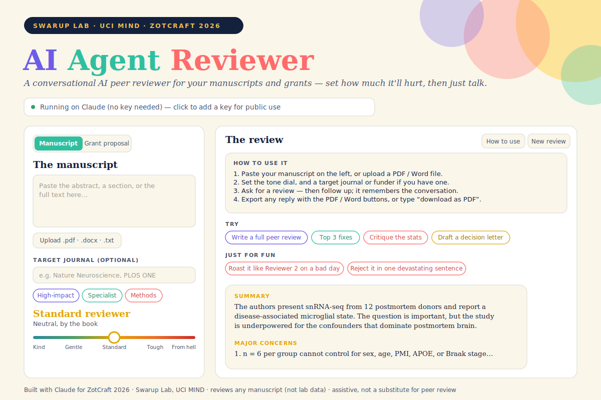

# AI Agent Reviewer

  

**A conversational AI peer reviewer for your manuscripts and grants.** Paste a paper or a proposal, set how much it should hurt, and just talk — it writes a full referee report, checks claims against the literature, adapts to your target journal or funder, remembers the whole conversation, and exports to PDF/Word.

Built with [Claude](https://claude.ai) for **ZotCraft 2026 — The Claude Cowork Challenge** (Swarup Lab, UCI MIND).

## Live demo

Hosted with GitHub Pages: **https://madhubioinformatics.github.io/AI-Agent-Reviewer/**

> On the hosted page you must open the **API key** panel and add your own [Anthropic API key](https://console.anthropic.com/settings/keys) (stored only in your browser). The no-key mode works only when the app runs as a live artifact inside Claude.

## What it does

- **Talks like a real reviewer.** A single-page chat *agent*, not a form. Ask for a full review, the top fixes, a decision letter, or anything about the document — then follow up, because it remembers the whole conversation.
- **Two modes.** Review a **manuscript** (journal peer review) or a **grant proposal** (study-section style: Significance, Investigator(s), Innovation, Approach, Environment, Specific Aims, feasibility).
- **A brutality dial** from *Kind mentor* to *Reviewer #2 from hell* — the interface heats from teal to red as you turn it up.
- **Venue calibration.** Set a target journal (Nature tier, specialist, methods, clinical, megajournal) or funder (NIH R01 / R21 / F-K, NSF, Foundation), and the review recalibrates its bar and decision thresholds. The same paper can be "major revision" for one venue and "reject — out of scope" for another.
- **Literature lookup (optional).** With the PubMed / bioRxiv connectors on, it can fetch a paper by PMID / DOI / title and review it, or check your claims against the published literature (citing real PMIDs).
- **Export.** Download any reply as **PDF** or **Word** with the buttons under it, or just type *"download as PDF and Word."* Copy is always available.
- **Fun built in.** One-tap starter prompts and a *"Just for fun"* row ("Roast it like Reviewer 2 on a bad day"), plus a built-in **How to use** guide.
- **Honest by design.** It grounds everything in the text you give it, never invents references, and is upfront that it's assistive — not a substitute for real peer review.

## Running it

A single static file (`index.html`) — no build step, no dependencies to install. Two ways to power the model:

1. **Inside Claude (no API key).** Open the file as a live artifact in a Claude chat; it uses your Claude session automatically. This is how it was built and demoed.
2. **Downloaded or on GitHub Pages (bring your own key).** Open `index.html` in a browser or host it, then add your own Anthropic API key in the panel at the top.

> The no-key path can't work on a public page — the browser can't reach the model without credentials — so a hosted deployment needs each user to add their own key (or a small server-side proxy that holds one key). The PubMed / bioRxiv lookup uses Claude account connectors, so it works best inside Claude.

### Host it yourself

Settings → Pages → Deploy from a branch → `main` / root. Live at `https://<username>.github.io/AI-Agent-Reviewer/`.

## How to use

1. Choose **Manuscript** or **Grant proposal**.
2. Paste the text on the left, or upload a PDF / Word / TXT file.
3. Set the tone dial, and a target journal or funder if you have one.
4. Ask for a review — then follow up (*"now be harsher," "expand point 3," "would this pass at PLOS ONE?"*).
5. Export any reply with the **PDF / Word** buttons.

## A 3-minute demo

1. Paste a known-flawed published abstract; set the journal to a top tier, dial to *Standard*.
2. Ask: *"Write 6 major and 6 minor comments with a final decision."* — the full referee report appears.
3. Drag the dial to *Reviewer #2 from hell* and ask *"now be brutal"* — for the laugh.
4. Ask *"would this pass at PLOS ONE instead?"* — it re-judges for a soundness-only journal.
5. Switch to **Grant proposal**, tap **NIH R01**, and ask *"review these Specific Aims for a study section."*

## How it works

A single-page app that calls Claude's messages API. Each turn sends the manuscript as context plus the running conversation, so the agent has memory. PubMed / bioRxiv are wired as connectors; literature lookups fall back gracefully to text-only when unavailable. PDF export uses jsPDF; Word export produces a Word-openable document; PDF/Word text extraction on upload uses pdf.js and mammoth.js.

## Credits & licensing

- Powered by [Claude](https://claude.ai) (Anthropic).
- Fonts: [Inter](https://rsms.me/inter/) and [Newsreader](https://fonts.google.com/specimen/Newsreader) via Google Fonts (OFL).
- [pdf.js](https://mozilla.github.io/pdf.js/) (Apache-2.0), [mammoth.js](https://github.com/mwilliamson/mammoth.js) (BSD-2), [jsPDF](https://github.com/parallax/jsPDF) (MIT).
- Everything is open-source and properly licensed.

Released under the [MIT License](LICENSE). Fork it, remix the personas, point it at your own field.
